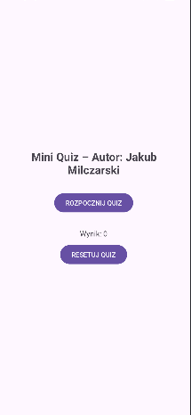
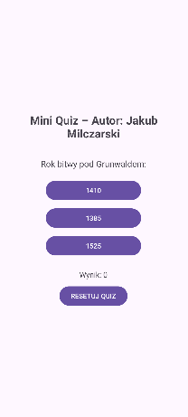

# Aplikacja „Mini Quiz”
**Autor:** Jakub Milczarski

## Opis projektu
Mobilna aplikacja edukacyjna stworzona w środowisku **Android Studio**. Aplikacja pozwala użytkownikowi na sprawdzenie swojej wiedzy w prostym quizie wielokrotnego wyboru. 

## Funkcjonalności
* **Dynamiczne losowanie:** Każda sesja quizu to 5 losowych pytań z puli zapisanej w kodzie.
* **System punktacji:** Wynik jest aktualizowany na bieżąco po każdej odpowiedzi.
* **Resetowanie:** Możliwość wyczyszczenia wyniku i ponownego podejścia do quizu.
* **Interfejs UI:** Zgodny z wytycznymi (LinearLayout, układ pionowy, centralne wyrównanie).

## Technologie
* **Język:** Java
* **Layout:** XML
* **Platforma:** Android (Min SDK 24+)

| Stan początkowy | W trakcie pytania | Wynik końcowy |
| :---: | :---: | :---: |
|  |  |  |
